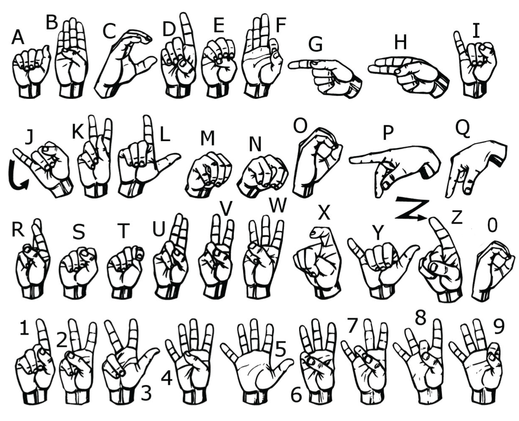

# ✋ Hand Sign Alphabet Recognition

## Project Overview

A deep learning system that classifies hand sign gestures corresponding to alphabetic characters (A–Z) using convolutional neural networks.

The model uses transfer learning with the MobileNetV2 architecture and is trained on the ASL-HG dataset available on Mendeley Data:

[ASL-HG: American Sign Language Hand Gesture Image Dataset](https://data.mendeley.com/datasets/j4y5w2c8w9/1)



---

# 🚀 Getting Started

## Requirements

- Python 3.11
- [uv](https://docs.astral.sh/uv/) package manager

## Install uv

### Linux / macOS

```bash
curl -LsSf https://astral.sh/uv/install.sh | sh
```

### Windows (PowerShell)

```powershell
powershell -ExecutionPolicy ByPass -c "irm https://astral.sh/uv/install.ps1 | iex"
```

---

# 📦 Project Setup

## Clone the repository

```bash
git clone git@github.com:Ryane-S/hand-gesture-recognition.git
cd hand-gesture-recognition
```

## Create and sync the virtual environment

```bash
uv sync
```

---

# ▶️ Run the Application

Launch the webcam interface:

### Linux / macOS

```bash
uv run python src/main.py
```

### Windows

```powershell
uv run python src\main.py
```

---

# 🧠 Model Architecture

- Transfer Learning with MobileNetV2
- TensorFlow / Keras
- Real-time webcam inference
- American Sign Language alphabet recognition (A–Z)
